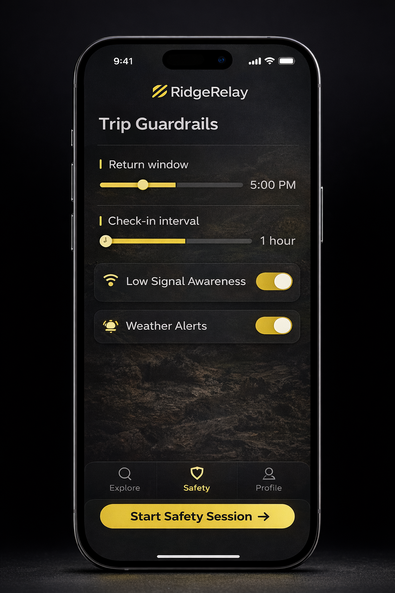

RidgeRelay — Intent-Aware Outdoor Safety (Academic Prototype)

RidgeRelay is a conceptual outdoor safety planning interface designed for environments with limited or no cellular connectivity.

Instead of relying on continuous GPS tracking or emergency alerts, RidgeRelay explores a different idea:

Plan intent before going offline.

This prototype demonstrates how intent declaration, visual guardrails, and structured escalation logic can improve safety awareness for hikers, runners, and solo adventurers.

This project was developed as part of the
University of Washington Tacoma – T-INFO 230: Foundations of Web Development curriculum.

Live Demo

🔗 https://jamdanie.github.io/RidgeRelayProject

What This Prototype Demonstrates

The website simulates a lightweight outdoor planning platform using static frontend technologies only.

Core demo features include:

Featured Trail Explorer

Interactive trail cards allow users to browse and open trail details.

Each trail card shows:

Trail name and location

Distance and elevation

Difficulty rating

Activity tags

Save-to-wishlist functionality

Trail Detail Drawer

Selecting a trail opens a slide-in drawer that contains:

Trail photo gallery

Weather preview (mock data from JSON)

Route preview map using Leaflet + GeoJSON

Save / wishlist actions

Quick planning shortcut

This interface demonstrates progressive disclosure, where detailed information appears only when needed.

Route Preview Map

The drawer loads a route preview using:

Leaflet.js

OpenStreetMap tiles

GeoJSON trail routes

This provides a lightweight demonstration of offline-friendly mapping architecture.

Weather Preview (Mock Data)

Weather information is loaded from:

assets/data/weather_demo.json

This simulates how a backend API could provide:

daily forecasts

precipitation chance

wind conditions

temperature ranges

The UI also generates a risk hint based on forecast conditions and trail difficulty.

Mobile-First Interface

The site is designed for outdoor mobile usage, including:

responsive layout

mobile drawer navigation

scrollable activity filters

touch-friendly controls

Activity Filtering

Users can filter trails by activity type:

Hiking

Trail Running

Backpacking

Mountain Biking

Overlanding

Dog-friendly

This demonstrates client-side filtering using vanilla JavaScript.

Wishlist System (Local Storage)

Users can save trails using the heart icon.

Saved trails are stored locally using:

localStorage

No accounts or servers are required.

Why RidgeRelay Exists

Many outdoor safety tools assume:

always-on GPS tracking

reliable cellular connectivity

complex setup during stressful situations

RidgeRelay explores a different model:

Declare intent before leaving service

Establish expected return time

Create structured escalation if a check-in is missed

This shifts the focus from reactive emergency response to preventative planning and awareness.

Design Principles (HCI Focus)

The interface follows several Human-Computer Interaction (HCI) principles.

Intent Before Interface

Users define their trip expectations before entering low-signal environments.

This reduces ambiguity and supports shared situational awareness.

Progressive Disclosure

The interface reveals complexity only when necessary.

Example:

Trail cards → quick overview

Drawer → detailed information

Map + weather → deeper context

Calm Interaction Design

The UI avoids panic-driven patterns.

Instead it uses:

clean typography

restrained color palette

limited motion

clear visual hierarchy

This supports low-stress decision making outdoors.

Constraint-Driven Design

This prototype intentionally avoids:

backend services

live GPS tracking

account systems

real emergency dispatch features

These constraints help emphasize planning clarity over technical complexity.

Tech Stack

The project is intentionally lightweight and frontend-only.

Technologies used:

HTML5

CSS3

Vanilla JavaScript

Leaflet.js (mapping)

GeoJSON (trail route data)

GitHub Pages (deployment)

No frameworks or build tools were used.

Project Structure
RidgeRelayProject
│
├── index.html
├── css/
│   └── styles.css
├── js/
│   └── main.js
├── assets/
│   ├── data/
│   │   └── weather_demo.json
│   ├── img/
│   ├── maps/
│   │   ├── bridal-veil-falls-wa.geojson
│   │   └── rattlesnake-ledge.geojson
│   └── video/
├── favicon/
└── README.md
Educational Goals

This project demonstrates:

responsive web design

modular JavaScript architecture

accessible semantic HTML

client-side data handling

human-centered interface design

concept-to-prototype system thinking

Important Disclaimer

RidgeRelay is a concept prototype only.

It does not provide emergency services, GPS tracking, or real safety monitoring.

The project exists solely to explore UX approaches to outdoor safety planning.

Feedback

If you found this concept interesting or useful, feel free to:

⭐ Star the repository
💬 Share feedback or ideas

Constructive discussion about outdoor safety design is always welcome.
